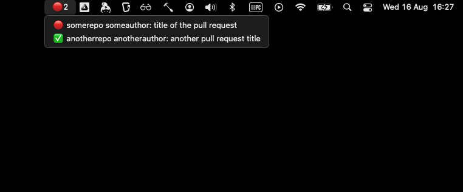

# Hammerspoon config

Config does 2 things:

- Set my keyboard layout correctly when I plug/unplug external keyboard.
- Display a menubar with a list of github PRs either requiring my review or authored by me but not yet merged.

# Installation

- Install [Hammerspoon](https://www.hammerspoon.org/): `brew install hammerspoon --cask`
- Install [PyGithub](https://github.com/PyGithub/PyGithub) : `pip install PyGithub`
- Add this repo under `~/.hammerspoon`: `git clone git@github.com:c2mda/hammerspoon.git ~/.hammerspoon`
- Create a [github auth token](https://docs.github.com/en/authentication/keeping-your-account-and-data-secure/managing-your-personal-access-tokens#creating-a-personal-access-token-classic) and put it in `~/github_auth_token.txt`.
